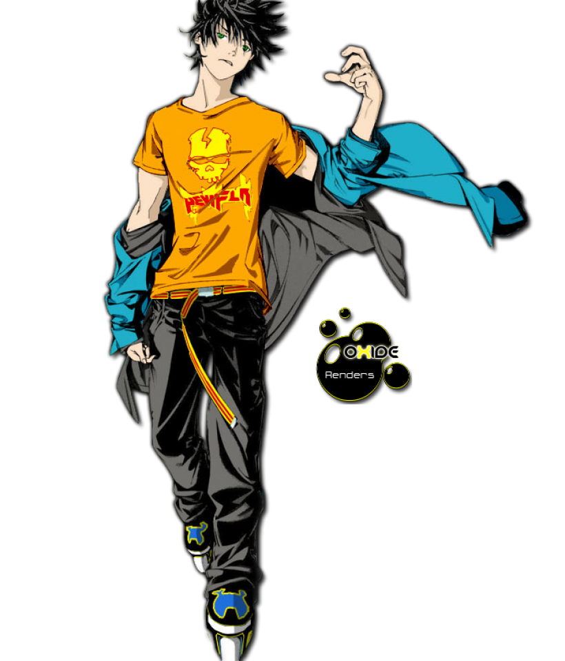

<h1 align="center">Hi there I'm Larry </h1>
<body>
<br>
<div align="center">

</div>
<br>


<h2 align="center"> 👁️‍🗨️ About me 👁️‍🗨️ </h2>

```zsh
> Air Gear
```

 

```js
My Profile v2.0.2: 破壊「はかい」
-------------------------------
Username: Larry Aka PeacefulWanderer.
WhoamI: Friendly neighborhood Barista and Web Developer. Also musician (more or less).
OS: MacOS  20.10.1 
Shell: Bash, Iterm2. 
FavouriteAnime: Air Gear 💻 🛼 🛹
Loves: 中野五月 (Anime) (❤️ ω ❤️), Videogames 🎮, To play my Guitar 🎸.
Pronouns: He-Him.
Location: Brooklyn, New York.
Languages: HTML, CSS, and JavaScript.
Hobbies: Photography, Cooking, Skating, and Programming
Learning: Python, JavaScript, and ReactJs.
FavouriteSong: Plastic Door by Kenny Hoopla.
Hobbies: Gaming,Watching anime,Coding 
while I am listening music.
My Favourite Artist (アイドル):  Souly Had, Kenny Hoopla, Umi, Paramore, Jaden Smith, and Tobi Lou. 🎤🎶🎼

```


<div>
<br>
<br>
<br>
<br>

<p align="right"><a href = "https://www.youtube.com/watch?v=aqqOli2a1gk"></a><b>Souly Had -<br>
                  🎵By Myself (Visualizer)🎵 
                  </b></p>
<br>
<br>

<p align="left"><a href = "https://www.youtube.com/watch?v=HlFuUWShuYM"></a><b><br><br>KennyHoopla - plastic door// (Live Performance)。🎶🆙</b></p>

<br>
<br>

<p align="right"><a href="https://www.youtube.com/watch?v=D5qUpJo_Gac"></a><b><br>雨宮天🎶UMI - Love Affair [Official Video] | Episode 1 'Love Language'。🎶💌</b></p>
<br>
</div>
<br>

<div>
<h2 align="center"> 🔎Knowledge📖 </h2>
</div>
<div align = "center">
<p align = "justify">I like to do some projects on VSCode and learn how to use my command line or sometimes I use Udemy to follow topics and languages I want to learn. I love the challenges because I try to think of other possibilities to solve some problems using different programming languages. <br></p>
<p align = "center">
  
  
  
  
  
  

  
   
  </p>

</div>

<br>

<h2 align = "center"> 📉 GitHub Stats</h2>
<div>
<p align = "center">
    <a href="https://git.io/streak-stats"></a>
  
 
  
 
  
  <br>
  
</p>
</div>
<div align="center"></div>  
<br>

# My contributions game 🐍🎮


<br>

<h2 align ="center"> 📝 Contact me 📝</h2>
<br> 
<div align="center">
<a href="https://github.com/LarryPursuit" target="_blank">

</a>
<a href="https://twitter.com/The25thWanderer" target="_blank">

</a>
<a href="https://www.linkedin.com/in/lma1992/" target="_blank">

</a>  <br>
</div>  


</div>  
<br>
<div>
<h2 align="center">Thank you for reading 🙋🏽‍♂️</h2>
<div>
<p>


   </p>
  </div>
<br> 
<br>
<br>
<br>
<br>

